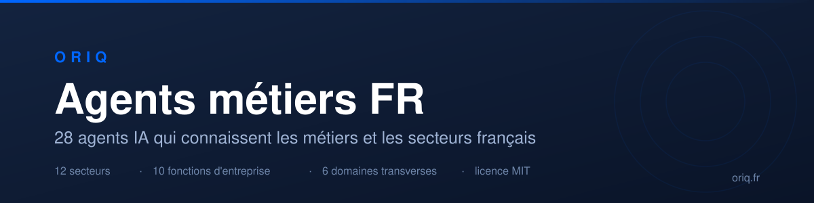

> **28 agents IA** qui connaissent les métiers et les secteurs français.
> **12 secteurs**, **10 fonctions d'entreprise**, **6 domaines transverses**.
> Écrits et utilisés en production par [**Oriq**](https://oriq.fr), agence IA française.

[](https://oriq.fr)
[](#2-avec-claude-code)
[](#3-avec-un-autre-outil-ou-à-la-main)
[](#1-sans-rien-installer-dans-une-conversation)
[](LICENSE)


## Démarrage rapide

```
/plugin marketplace add ORIQ-IA/agents-metiers-fr
/plugin install agents-secteurs-fr@oriq
```

Pas de Claude Code ? [Copiez le fichier de votre secteur dans une conversation](#1-sans-rien-installer-dans-une-conversation), ça marche aussi bien.

## Pourquoi ces agents existent

Un agent générique vous répondra que « l'IA peut automatiser la rédaction de vos actes ». Un notaire vous dira que ce n'est pas le sujet, que ce qui l'intéresse c'est de ne pas rater un délai, parce que sa responsabilité est engagée sur chaque acte.

Ces agents sont écrits du deuxième point de vue.

## Ce que ça change

Extrait de `oriq-secteur-notariat-juridique` :

> **Ce qui décide**
>
> Le risque professionnel avant le gain de temps. Un système qui réduit le risque d'erreur ou
> d'omission de délai intéresse plus qu'un système qui écrit vite. La responsabilité du
> professionnel est engagée sur chaque acte.

> **Contraintes**
>
> Secret professionnel absolu. Déontologie stricte. Archivage légal avec des durées longues.
> La confidentialité entre dossiers et entre clients est non négociable, y compris à l'intérieur
> de l'étude. Un système qui laisse fuir un passage d'un dossier vers un autre est disqualifiant.

Chaque agent suit la même structure : l'organisation réelle du métier, les frictions, ce qui déclenche une décision, les contraintes réglementaires, les cas d'usage qui portent, et les garde-fous.

## Utilisation

Trois façons, de la plus simple à la plus complète. Commencez par la première, elle ne demande rien à installer.

### 1. Sans rien installer, dans une conversation

Marche avec Claude, ChatGPT, Gemini, Le Chat. Aucun compte particulier, aucun outil, aucune ligne de commande.

1. Dans le tableau plus bas, cliquez sur le nom de l'agent qui correspond à votre sujet, par exemple `oriq-secteur-btp` pour le bâtiment.
2. En haut à droite du fichier qui s'ouvre, cliquez sur le bouton **Copy raw file** (l'icône de deux feuilles superposées).
3. Ouvrez une conversation avec votre assistant et collez.
4. Juste en dessous, dans le même message, écrivez votre question. Par exemple : « Je veux mettre en place un assistant documentaire dans mon entreprise, par où commencer ? »

L'assistant répondra avec la connaissance du secteur au lieu de généralités.

### 2. Avec Claude Code

Deux commandes à taper dans Claude Code :

```
/plugin marketplace add ORIQ-IA/agents-metiers-fr
/plugin install agents-secteurs-fr@oriq
```

Trois plugins, installez ceux qui vous servent :

| Plugin | Contenu |
|---|---|
| `agents-secteurs-fr` | Les 12 agents sectoriels |
| `agents-fonctions-fr` | Les 10 agents par fonction d'entreprise |
| `agents-transverses-fr` | Les 6 agents transverses, appelés par les deux autres |

Les mises à jour arrivent ensuite toutes seules.

### 3. Avec un autre outil, ou à la main

```bash
git clone https://github.com/ORIQ-IA/agents-metiers-fr.git
cd agents-metiers-fr
./install.sh
```

Le script copie les agents dans `~/.claude/agents/`. Pour n'installer qu'un groupe : `./install.sh secteurs`.

Pour un seul agent, un fichier suffit :

```bash
cp plugins/agents-secteurs-fr/agents/oriq-secteur-btp.md ~/.claude/agents/
```

Les fichiers sont du Markdown avec un en-tête YAML, lisible par tout agent qui suit la convention `AGENTS.md` : Cursor, Codex, Gemini CLI, Aider, Windsurf et les autres.

## Les agents

### Secteurs (12)

| Agent | Couvre |
|---|---|
| [`oriq-secteur-btp`](plugins/agents-secteurs-fr/agents/oriq-secteur-btp.md) | Bâtiment, travaux publics, artisanat |
| [`oriq-secteur-collectivites`](plugins/agents-secteurs-fr/agents/oriq-secteur-collectivites.md) | Communes, EPCI, bailleurs, organismes territoriaux |
| [`oriq-secteur-expertise-comptable`](plugins/agents-secteurs-fr/agents/oriq-secteur-expertise-comptable.md) | Cabinets comptables et audit |
| [`oriq-secteur-formation-education`](plugins/agents-secteurs-fr/agents/oriq-secteur-formation-education.md) | Organismes de formation, enseignement |
| [`oriq-secteur-immobilier`](plugins/agents-secteurs-fr/agents/oriq-secteur-immobilier.md) | Transaction, gestion locative, syndic, promotion |
| [`oriq-secteur-industrie`](plugins/agents-secteurs-fr/agents/oriq-secteur-industrie.md) | Production, qualité, maintenance |
| [`oriq-secteur-mutuelle-assurance`](plugins/agents-secteurs-fr/agents/oriq-secteur-mutuelle-assurance.md) | Mutuelles, assurance de personnes, protection sociale |
| [`oriq-secteur-notariat-juridique`](plugins/agents-secteurs-fr/agents/oriq-secteur-notariat-juridique.md) | Notariat, avocats, professions juridiques |
| [`oriq-secteur-retail-ecommerce`](plugins/agents-secteurs-fr/agents/oriq-secteur-retail-ecommerce.md) | Commerce, distribution, vente en ligne |
| [`oriq-secteur-sante`](plugins/agents-secteurs-fr/agents/oriq-secteur-sante.md) | Établissements de santé, médico-social |
| [`oriq-secteur-services-b2b`](plugins/agents-secteurs-fr/agents/oriq-secteur-services-b2b.md) | Conseil, ingénierie, agences, ESN |
| [`oriq-secteur-transport-logistique`](plugins/agents-secteurs-fr/agents/oriq-secteur-transport-logistique.md) | Exploitation, supply chain |

### Fonctions (10)

| Agent | Couvre |
|---|---|
| [`oriq-metier-achats`](plugins/agents-fonctions-fr/agents/oriq-metier-achats.md) | Sourcing, consultations, contrats fournisseurs |
| [`oriq-metier-commercial`](plugins/agents-fonctions-fr/agents/oriq-metier-commercial.md) | Cycle de vente, saisie, préparation de rendez-vous |
| [`oriq-metier-direction-generale`](plugins/agents-fonctions-fr/agents/oriq-metier-direction-generale.md) | Arbitrages et langage d'un dirigeant |
| [`oriq-metier-dsi`](plugins/agents-fonctions-fr/agents/oriq-metier-dsi.md) | Exigences de sécurité, conditions d'acceptation d'un projet |
| [`oriq-metier-finance`](plugins/agents-fonctions-fr/agents/oriq-metier-finance.md) | Clôture, contrôle de gestion, facturation, recouvrement |
| [`oriq-metier-juridique`](plugins/agents-fonctions-fr/agents/oriq-metier-juridique.md) | Contrats, conformité, contentieux |
| [`oriq-metier-marketing`](plugins/agents-fonctions-fr/agents/oriq-metier-marketing.md) | Production de contenu, mesure |
| [`oriq-metier-production-ops`](plugins/agents-fonctions-fr/agents/oriq-metier-production-ops.md) | Planification, qualité, maintenance, terrain |
| [`oriq-metier-rh`](plugins/agents-fonctions-fr/agents/oriq-metier-rh.md) | Recrutement, administration, formation |
| [`oriq-metier-service-client`](plugins/agents-fonctions-fr/agents/oriq-metier-service-client.md) | Volume, qualité de réponse, relation usager |

### Transverses (6)

| Agent | Couvre |
|---|---|
| [`oriq-architecte-rag`](plugins/agents-transverses-fr/agents/oriq-architecte-rag.md) | Ingestion, découpage, recherche, citation des sources |
| [`oriq-cyber-ia`](plugins/agents-transverses-fr/agents/oriq-cyber-ia.md) | Injection par le contenu, fuite de données, cloisonnement |
| [`oriq-data-engineer`](plugins/agents-transverses-fr/agents/oriq-data-engineer.md) | Pipelines, qualité, modélisation |
| [`oriq-integration-api`](plugins/agents-transverses-fr/agents/oriq-integration-api.md) | API, webhooks, synchronisation, gestion des pannes |
| [`oriq-rgpd`](plugins/agents-transverses-fr/agents/oriq-rgpd.md) | Bases légales, minimisation, registre, droits des personnes |
| [`oriq-voix-ia`](plugins/agents-transverses-fr/agents/oriq-voix-ia.md) | Transcription, synthèse, interruption, conversation parlée |

Les agents se renvoient la main entre eux. Le bloc « Relais » en fin de fichier indique lequel prendre ensuite.

## Ce que ces agents ne sont pas

Ce ne sont pas des conseils juridiques. `oriq-rgpd` et les mentions réglementaires des agents sectoriels décrivent un cadre, ils ne remplacent pas un avis.

Ce ne sont pas des agents de code. Ils portent de la connaissance métier, pas des recettes techniques.

Ils sont écrits pour le contexte français : vocabulaire, organisation des entreprises, droit applicable.

## Questions fréquentes

**Avec quels outils est-ce que ça marche ?**
Claude Code lit `~/.claude/agents/`. Cursor, Codex, Gemini CLI, Aider, Windsurf et les autres agents qui suivent la convention `AGENTS.md` lisent des fichiers Markdown avec en-tête YAML, c'est exactement ce format. Aucune dépendance, aucune clé API, rien à installer d'autre.

**Est-ce que ça remplace mon `CLAUDE.md` ou mon `AGENTS.md` ?**
Non, c'est complémentaire. Votre fichier de projet décrit votre code. Ces agents apportent la connaissance d'un métier ou d'un secteur, qui ne se déduit d'aucun dépôt.

**À quoi ça sert concrètement ?**
À concevoir ou évaluer un projet IA pour un métier que vous ne connaissez pas de l'intérieur. Par exemple : que faut-il savoir avant de proposer un assistant documentaire à un cabinet d'expertise comptable, quelles contraintes déontologiques pèsent sur une étude notariale, ce qui déclenche vraiment une décision dans une direction des achats, pourquoi une DSI bloque un projet, quelles obligations s'appliquent aux données de santé.

**Mon métier n'est pas couvert.**
Ouvrez une issue en décrivant le métier et ses frictions réelles. Les contributions de praticiens sont ce qui fait la valeur de ce dépôt.

**Est-ce utilisable hors de France ?**
La structure oui, le contenu en partie seulement. Les contraintes réglementaires, les intitulés de poste et l'organisation décrite sont français. Le RGPD et le règlement européen sur l'IA s'appliquent dans toute l'Union, le reste est à adapter.

**Quelle licence ?**
MIT. Usage commercial autorisé, modification autorisée, attribution demandée.

## Autres publications d'Oriq

Les trois dépôts de l'organisation [ORIQ-IA](https://github.com/ORIQ-IA) sont publics et sous licence libre.

| Dépôt | Contenu |
|---|---|
| [referentiel-ia-act](https://github.com/ORIQ-IA/referentiel-ia-act) | Référentiel daté et versionné du règlement européen sur l'IA. Échéances, sanctions et obligations, chacune avec son article et sa source. JSON, CC BY 4.0 |
| [observatoire-ia-occitanie](https://github.com/ORIQ-IA/observatoire-ia-occitanie) | Relevé des offres d'emploi liées à l'IA en Occitanie, rapporté à la population d'entreprises. 7 jeux en CSV, CC BY 4.0 |

## Citer ce dépôt

Un fichier [CITATION.cff](CITATION.cff) est fourni. GitHub affiche un bouton « Cite this repository » en haut à droite, et les outils bibliographiques le lisent directement.

## Contribuer

Une correction de terrain vaut mieux qu'un ajout théorique. Si un agent décrit mal votre métier, c'est une issue utile. Voir [CONTRIBUTING.md](CONTRIBUTING.md).

Les principes communs aux 28 agents sont dans [CHARTE.md](CHARTE.md).

## Origine

Ces agents sont extraits de l'outillage de production d'[**Oriq**](https://oriq.fr), agence IA française basée à Toulouse. Ils sont utilisés en vrai sur des missions, pas écrits pour la vitrine.

### Ce qui peut vous servir tout de suite, gratuitement

**[Diagnostic IA Act](https://oriq.fr/ia-act/)**
Savoir en quelques minutes si le règlement européen sur l'intelligence artificielle s'applique à votre système, ce que vous devez faire et à quelle date. Le verdict est calculé par un moteur de règles adossé à un référentiel daté, pas rédigé par un modèle : il ne peut pas se tromper de date. Sans inscription.

**[Sanctions et calendrier IA Act](https://oriq.fr/ia-act/sanctions-et-calendrier/)**
Les montants de l'article 99 et le calendrier complet d'application, à jour du règlement (UE) 2026/1744 qui a reporté certaines échéances. Beaucoup de sources annoncent encore les anciennes dates.

**[Recherche dans vos documents](https://rag.oriq.fr)**
Ce que fait le produit Oriq : retrouver une information dans ses propres documents, avec la source exacte.

### Vous accompagner

Si un des cas d'usage décrits dans ces agents correspond à un besoin réel chez vous, c'est exactement le métier d'Oriq. Écrivez à contact@oriq.fr ou passez par [oriq.fr](https://oriq.fr).

## Licence

MIT. Voir [LICENSE](LICENSE).
